### How to use Google Cloud shell for docker containers

If you do not have docker installed on your local machine, but you want to use docker for a project for light processing, this guide may help you.

**Note:** This method is useful only for exploration/practise/testing purpose and since Google Cloud shell resets after inactivity it also deletes all docker images, containers etc. So do not use this to store critical data, but only for quick projects, temporary deployment etc.

<a id='toc'></a>
<a id='toc'></a>
## Table of Contents
* [1. Background](#background)
* [2. Use docker in Google Cloud shell](#gcp-cloud-shell-docker)
* [3. Deploy your app in docker container](#deploy-container)
  * [3.1 Prepare for app deployment](#gcp-prepare-deployment)
  * [3.2 Deploy docker container within Google Cloud shell](#gcp-local-container)
  * [3.3 Deploy docker container on Heroku](#gcp-heroku-container)

----

<a id='background'></a>
[back to TOC](#toc)
### 1. Background:
In the Machine Learning Zoomcamp course conducted by Alexey Grigorev (https://github.com/alexeygrigorev/mlbookcamp-code/tree/master/course-zoomcamp) in some of the exercises and for the projects, it is required that participants deploy their application into a docker container and further deploy their application to Cloud.

However, many participants have faced issues in getting docker to work on their local machine. This guide is an attempt to help around this situation and allow use of docker without docker being installed on local machine. 

To do this, you can use Google Cloud shell, which is a free machine in Google Cloud and has docker pre-installed. Anyone having a Google account (like Gmail account) can use this method.

----
<a id='gcp-cloud-shell-docker'></a>
[back to TOC](#toc)
### 2. Use docker on Google Cloud Shell

#### 2.1 Pre-requisite

The only pre-requisite for the method suggested in this guide is to have a Gmail account.

#### 2.2 Launch Google Cloud shell

**Google Cloud console**: Launch URL https://console.cloud.google.com and login with your Google id (Gmail id). Click on the >_ icon to launch Google Clouc shell and click Continue, as shown below

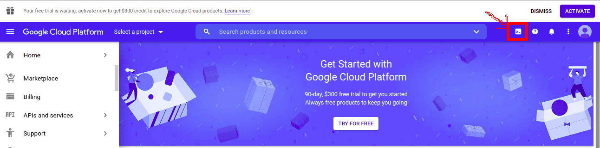

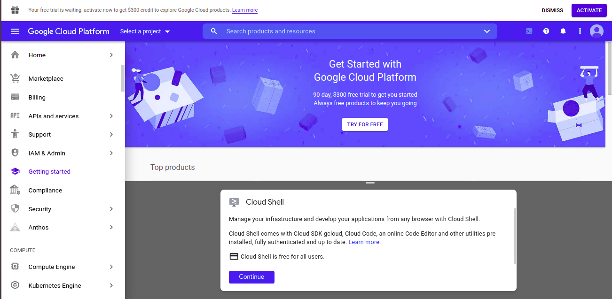

**Docker in Google Cloud shell**: On the command prompt you can run any docker commands. e.g. to check all containers (there will be none initially) 

```docker ps -a```

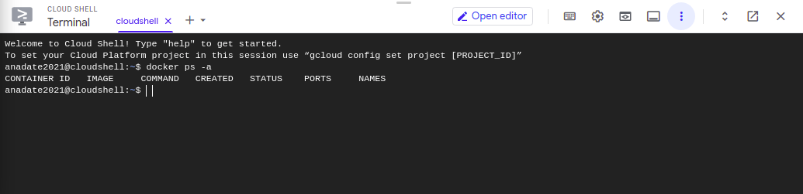

You can now use this Docker setup to download images, build your own docker images, launch containers etc. 

<a id='deploy-container'></a>
[back to TOC](#toc)
### 3. Deploy your app in docker container

Now you can deploy your app in a docker container. Below I have explained 2 options - 1. Deploy your app as docker container within Google Cloud shell, 2. Deploy your app as docker container to Heroku. You can choose to use any of these.

<a id='gcp-prepare-deployment'></a>
#### 3.1 Prepare for app deployment
Before you can deploy your app to a docker container, first prepare a folder for deployment and collect all the necessary files into the folder.

I will explain a scenario where suppose you have developed your application in let's say python on your machine, and now you want to deploy in a docker container.

**Upload files**
You can upload your application code, machine learning models, any python package dependencies management files (like requirements.txt or Pipfile and Pipefile.lock etc.) etc. from your local machine to Google Cloud shell. For this click on the 3 dots and click Upload.

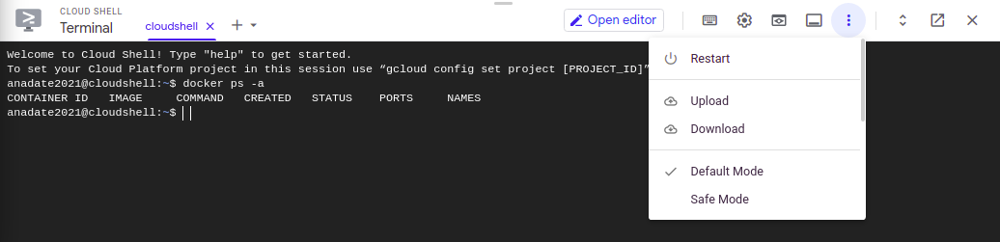

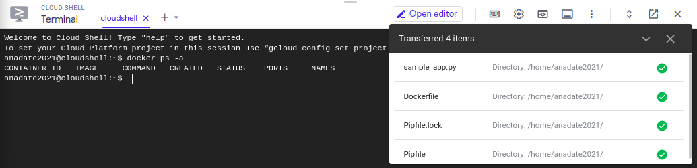

Check using ```ls``` command

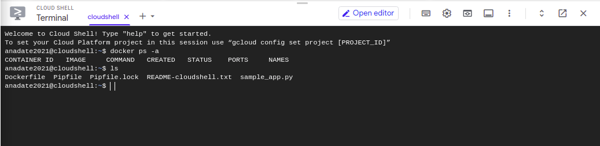

**Create folder for app and move files**

Now, create a directory where you will keep all the files to be deployed into the docker container, along with the Dockerfile (which has the instructions to build a container image). Them move/copy your application files and Dockerfile to this directory

```mkdir app-deploy```

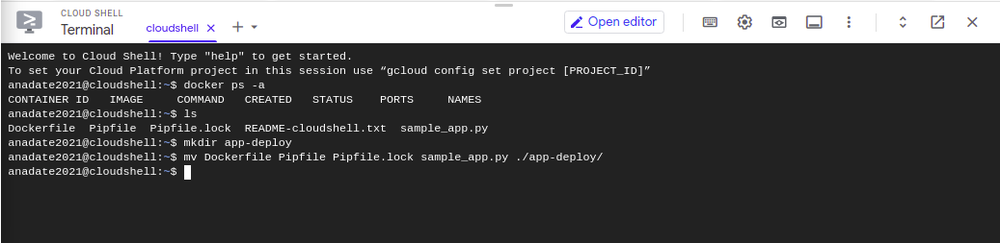


<a id='gcp-local-container'></a>
#### 3.2 Deploy docker container within Google Cloud shell

Let us see how to deploy you app to a docker container and access the application. 

A sample Dockerfile and python code is shown below.

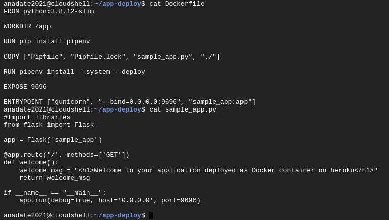

**Build docker image**
Build docker image from the Dockerfile. First change to the directory you created for deployment.

```cd app-deploy```

Now, build docker image. Below command will create a docker image with name my-image, with Dockerfile in current working directory (hence the .)

```docker build -t "my-image" .```

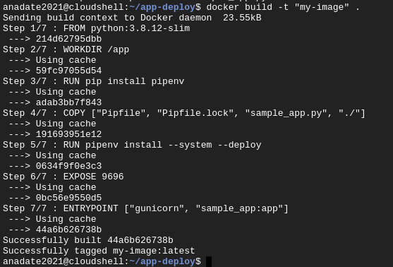

**Deploy docker container**
Now deploy your app as a docker container using the image that you built. Below command will launch a docker container, will delete when it is stopped (--rm flag), run it as a daemon (i.e. background process, the -d flag(, mapping port 8080 of the Cloud shell to port 9696 of container (since in Dockerfile we have exposed port 9696 of container and the gunicorn is running the app on port 9696), from image my-image.

```docker run --rm -d -p 8080:9696 my-image```

Check whether container is running

```docker ps -a```

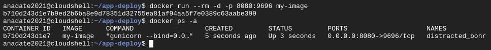

**Access your app**
Now you can access you app. If you can interact with you app from command line you can do so as shown below from the command prompt itself

```curl localhost:8080```


If you want to access the app from your web browser, then click on the **Web preview** option and click **Preview on port 8080**. If instead of port 8080 on Cloud shell, you had mapped to a different port, then use the option **Change port** under Web Preview to change port and access you application from web browser.

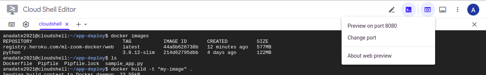

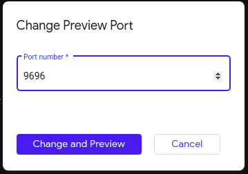

That completes the procedure for deploying app in a docker container in Google Cloud shell.

#### 3.3 Deploy docker container on Heroku

**Open Heroku account**

#### 2.2. Install Heroku command line interface (cli) on your machine

There are multiple ways to deploy a web app on Heroku (via the Heroku Dashboard, using CLI from your machine), of which I used the CLI option.

There are multiple options availabe to install Heroku cli - which can be found here - https://devcenter.heroku.com/articles/heroku-cli. I chose downloading the tarball, since it does not need any installation. 

**a. Download tarball**

To install from tarball, go to https://devcenter.heroku.com/articles/heroku-cli#tarballs and download the tarball for the Operating system of your machine. I downloaded for Ubuntu.

**b. Extract tarball**

Extract the tarball (Step fo Ubuntu shown below. For Windows simply use the WinZip or equivalent to extract/unzip from tarball).

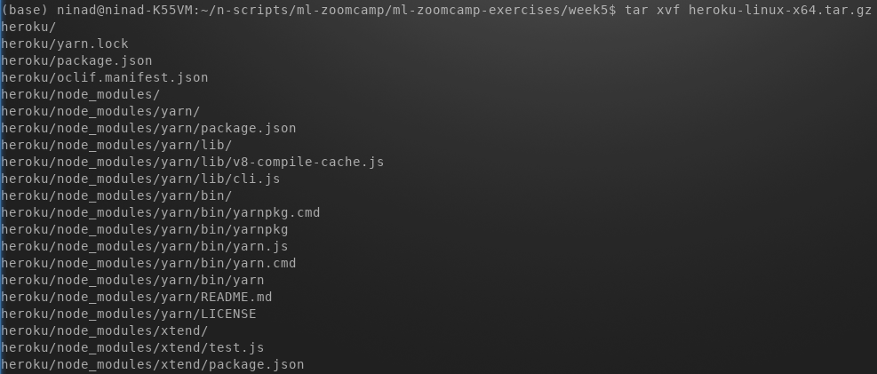

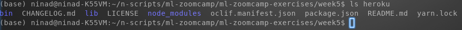

**c. Add heroku/bin to your PATH**

To add the heroku/bin path on a Linux machine, execute the below command. For Windows refer to https://helpdeskgeek.com/windows-10/add-windows-path-environment-variable/

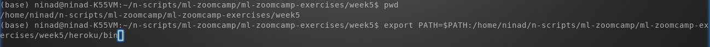

----
[back to TOC](#toc)
<a id='deploy-app'></a>
### 3. Deploy your Web app to Heroku
When using Heroku, you can deploy your Web app as a docker container to heroku, or you can deploy it without using docker. Following section explains both these options.

[back to TOC](#toc)
<a id='deploy-app-docker'></a>
#### 3.1 Deploy as a docker container to Heroku
To deploy your application to Heroku as a docker container, you need to first have docker installed and running on your machine.

**Docker deployment content is work in progress ...**

You can then follow the below simple steps to deploy to heroku as a docker container

**a. Prepare code base for docker deployment**

Create a directory for your deployment and copy your code for the Web app, any ML model files (if/as appropriate), python package dependencies (this example shows use of pipenv and hence Pipfile and Pipfile.lock, however you can requirements.txt or files as applicable for you)

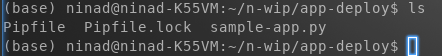

**b. Create Dockerfile**

Create Dockerfile (filename should be exactly this) in the same directory with appropriate lines for your docker image.

Below example shows, python:3.8.12-slim being used as base image, installing pipenv, then copying the Pipfile and Pipfile.lock that specify python dependency packages, installing the dependency packages using pipenv, then copying the python code for the web app, followed by defining port to be exposed and entrypoint command that should get run when docker container starts.

**Note:** One very important point I struggled and understood after a long time is that for gunicorn do not use anything like 

```ENTRYPOINT ["gunicorn", "--bind=0.0.0.0:9696", "sample_app:app"]```

Although using like this worked when running docker container locally on my machine, however failed when deployed to Heroku. Will try to investigate further and update once I know better. Meantime use something like

```ENTRYPOINT ["gunicorn", "sample_app:app"]```

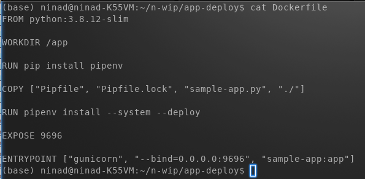

**c. Deploy to Heroku as docker container**

Run the following steps in sequence to deploy your web app as a docker container to Heroku.

**Login to heroku** : Verify heroku command is found (In step 2.2.c. above the path has already been set) in the path. Then using heroku cli, login to heroku.  Press any key when asked to do so.

```which heroku```

```heroku login```


  
This will open a tab in your web browser asking you to login to Heroku. Login to Heroku.

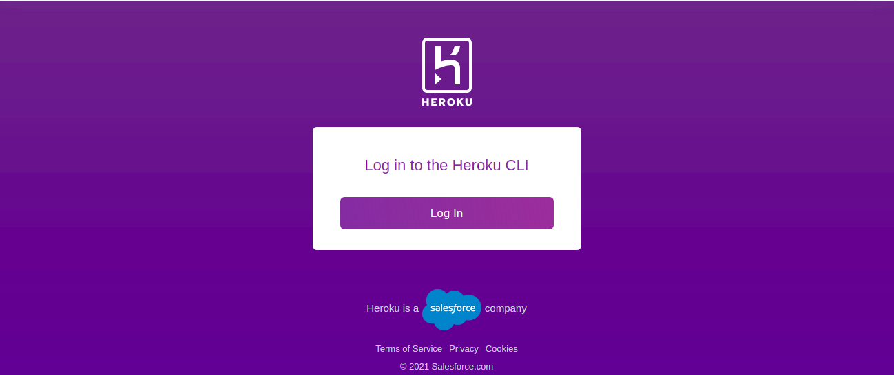

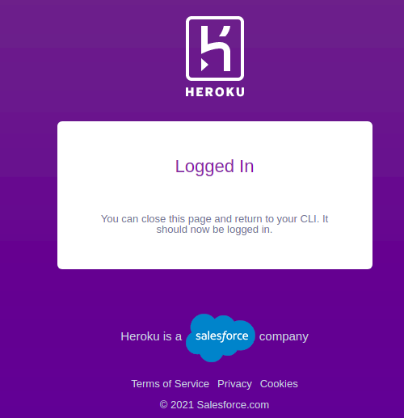

Now you can close this tab and return to the command prompt on your terminal
  
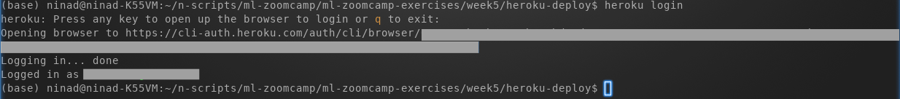

**Login to Heroku container**  : Login to Heroku container registry.

```heroku container:login```

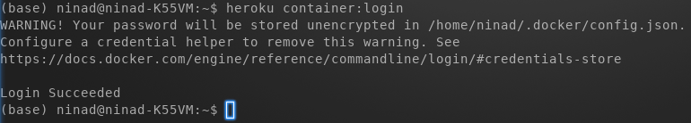

**Create app in Heroku**: Create an app in Heroku. Below example shows creating a app with the name ml-zoom-docker.

```heroku create ml-zoom-docker```

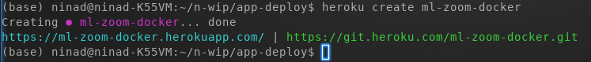

**Push docker image to Heroku**: Push docker image to Heroku container registry. When you run the below command, the Dockerfile will be used to build the docker image locally on your machine and then push the image to Heroku container registry. Using the -a flag you specify the application name (e.g. ml-zoom-docker app that you created above).

```heroku container:push web -a ml-zoom-docker```

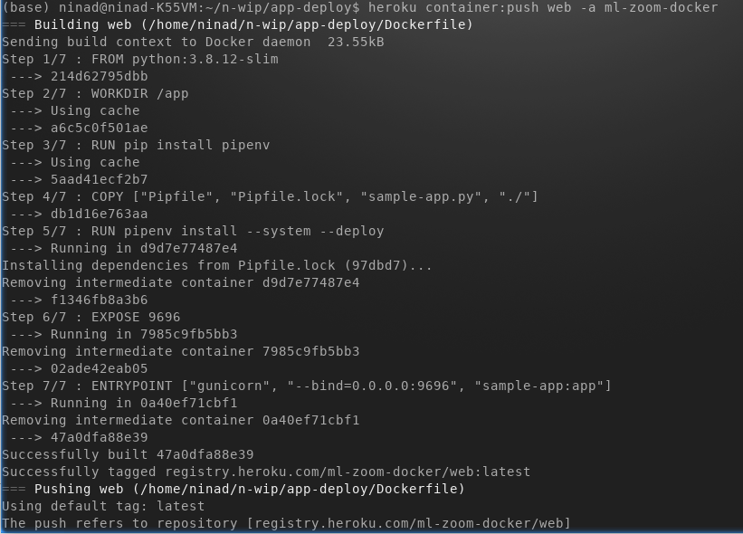

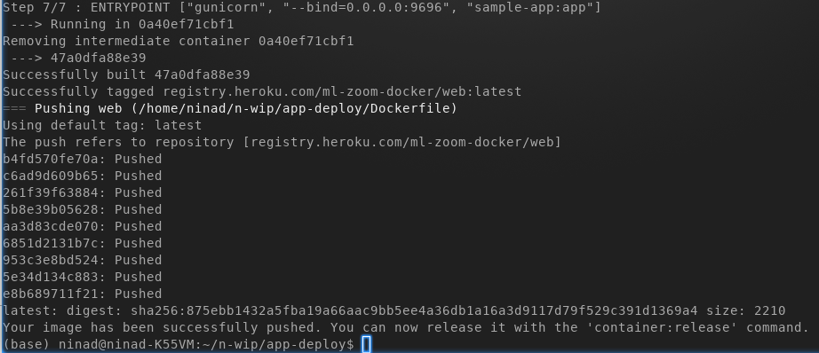

**Release container**: Deploy container on Heroku. When you run the below command, a docker container will be launched in Heroku from the docker image that you pushed to Heroku container registry.

```heroku container:release web -a ml-zoom-docker```

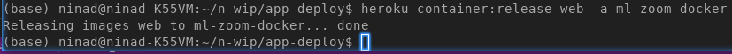

**Launch you app**: Open your web app. For this you can go your web browser and open your application URL with appropriate path (e.g. my sample application would run at https://ml-zoom-docker.herokuapp.com/welcome - since ml-zoom-docker is the name of my app and I am serving page /welcome via my sample app)

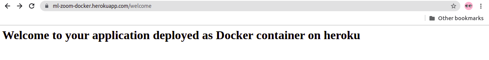

**Great !!!** You web app is now running in Heroku as a docker container !!!

---

[back to TOC](#toc)
<a id='deploy-app-nodocker'></a>
#### 3.2 Deploy without docker container to Heroku
To deploy your Web app to Heroku, you need to have all your code in one place and create a few configuration files.

**a. Prepare code base**

Create a directory for your deployment and copy your code for the Web app and any ML model files (if/as appropriate)


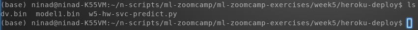

**b. Create configuration files**

**Specify Python version** : This is an optional step, required only if you want a specific Python version to be used in Heroku to run your web app. Check the Python version (where you have the appropriate version and where you developed/tested your code) using command ```python -V```.

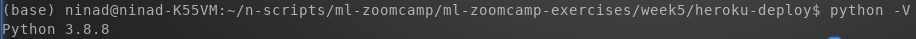

Specify the version into a file named runtime.txt [Ensure everything is lower case in the file and that you mention the full version]

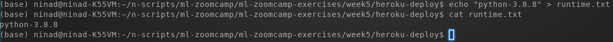

*Refer to https://devcenter.heroku.com/articles/python-runtimes for more details*

**Specify Python dependencies/packages** : Create requirements.txt file and specify the Python packages required for the execution of your Web app.

You could choose to use the command ```pip freeze > requirement.txt``` to populate requirements.txt based on all packages installed in your current active python environment. Or add the package names manually. I added manually.

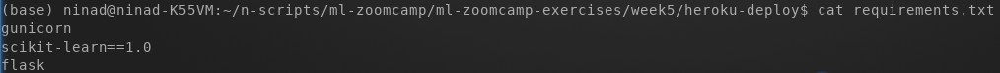

*Note: As part of the course homework 5, scikit-learn version 1.0 is required since the model was trained using this version. Added gunicorn, to be used as the web server to run the web app in Heroku (there could be other options, for now I know of this)*

**Specify commands to be executed by the app on startup** : Heroku apps include a Procfile that specifies the commands that are executed by the app on startup.

The command for this example would be as below. 

web: gunicorn \<name of your python script without the .py\>:\<instance name of Flask\>

* web: indicates that the web server process can receive external HTTP traffic from Heroku’s routers.
* gunicorn is the web server (software) that will be used
* app is the instance name of Flask when you define something like **app = Flask(somename_foryourapp)**

e.g. I used ```web: gunicorn w5-hw-svc-predict:app``` since my python file name is w5-hw-svc-predict.py and I have defined Flask instance as ```app = Flask('churn')```
  
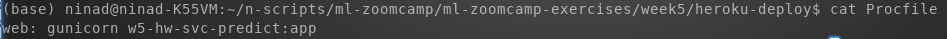
  
*Find more info on Procfile [here](https://devcenter.heroku.com/articles/procfile)*
  
**c. Deploy web app to Heroku**

Heroku supports multiple methods for deployment - Git (GitHub, Heroku Git), Docker container image, Integrations. So far, I have explored the Git method using Heroku git.
  
*Assuming you have git installed on your machine. If not install it. (On Ubuntu using ```sudo apt install -y git```)*
  
**Initialize local git repository** : After having collected your code and defined necessary configurations files, initialize local git repository
  
```git init```
  
Add all the contents of the directory to git repo
  
```git add .```
  
Commit changes to local git repo
  
```git commit -m "some commit message"```
  
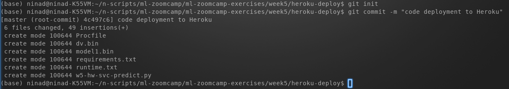

**Login to heroku** : Verify heroku command is found (In step 2.2.c. above the path has already been set) in the path. Then using heroku cli, login to heroku.  Press any key when asked to do so.

```which heroku```

```heroku login```


  
This will open a tab in your web browser asking you to login to Heroku. Login to Heroku.


Now you can close this tab and return to the command prompt on your terminal
  

  
**Create an application** : You need to create a new application in Heroku before deploying the code to it. Create an application
  
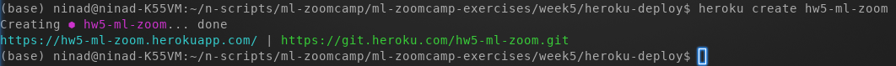
  
This creates an application and also a Heroku git repo for this application. You can go to the Heroku dashboard to see the application being created with a default web page.
  
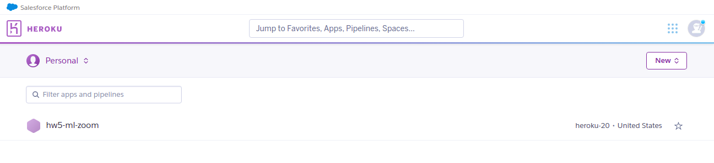
  
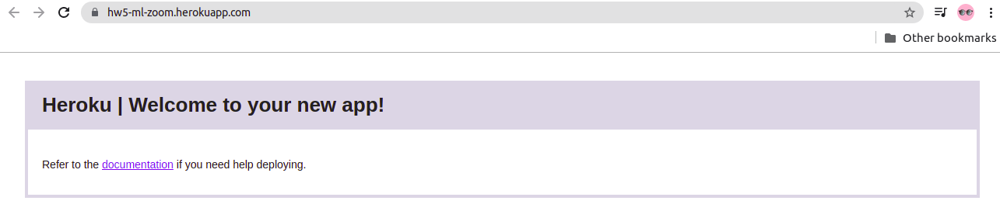

**Push code and configurations to Heroku git for deployment** : You can now push to remote git (Heroku git). Once the contents are pushed to Heroku git, it automatically triggers the deployment.
  
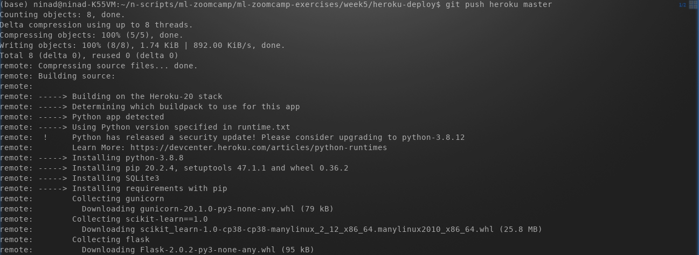
  
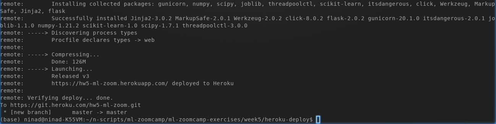

**Test your Web App**

You can now test whether your Web App is running successfully (now being hosted on Heroku). From your local machine (or from anywhere, where you have python installed, requests package installed and having internet access) execute the code to test your Web App.

Below is sample test scenario for the homework of Week5 of ML Zoomcamp course.
  
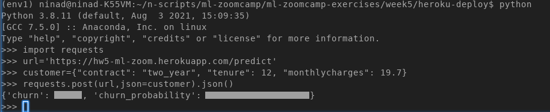

