## How to use PythonAnywhere to host your python web app for free

#### Background: 
In the Machine Learning Zoomcamp course conducted by Alexey Grigorev (https://github.com/alexeygrigorev/mlbookcamp-code/tree/master/course-zoomcamp) in Week/Session #5, it is required to deploy a web service which can accept user provided customer data nad using a trained ML model, predict whether the customer will churn or not.

For this, participants can either deploy the web service locally on their machine, inside a docker container on their machine, or in Cloud (AWS, Azure. Google etc.).

There is one more option that was suggested - which is using PythonAnywhere, which provides users to host python based web application for free. This option can especially be useful when working on the Project 1 as part of this course, and hence I thought of exploring this option and preparing this reference for others to follow if they wish to use this option.

#### 1. Signup
   
**a.** Go to PythonAnywhere website at https://www.pythonanywhere.com/ and click on **Pricing & signup**.


**b.** Click **Create a Beginner account** , then provide your details to get your account created.


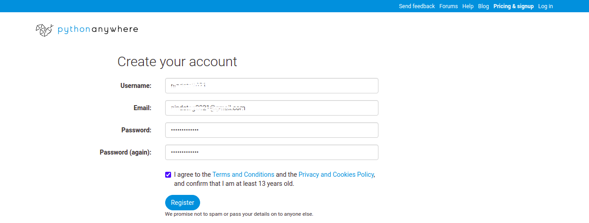

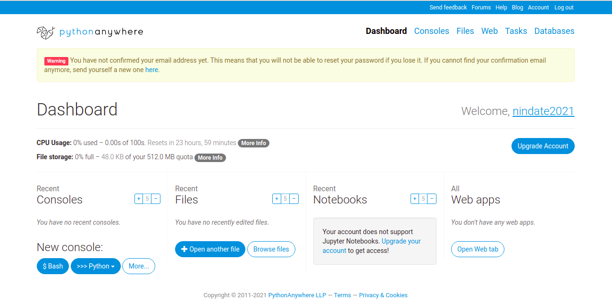

**c.** You will see a Warning to confirm you email. Confirm your email, login again and the Warning disappears.

You will see the PythonAnywhere Dashboard giving you a summary.

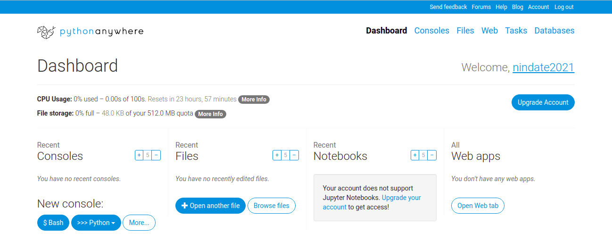

#### 2. Prepare the environment

**a.** Many of the popular python libraries are pre-installed. You can check that by opening the Bash console. 

To open the Bash console, on the Dashboard page under Consoles, under New console click **$ Bash**. This will open the bash console on the underlying linux machine.
   
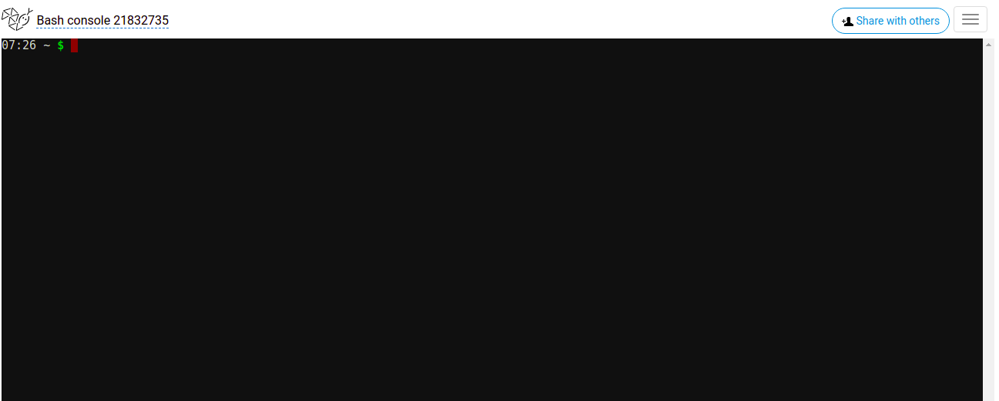
   
**b.** Type the command ```pip list``` to see the pre-installed python packages and their versions.
   
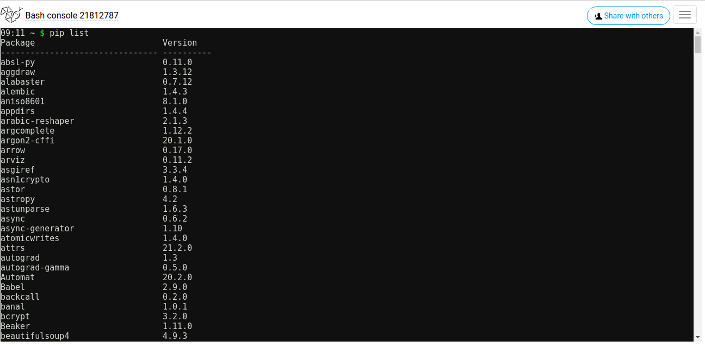
   
**c.** For the Machine Learning Zoomcamp course Week#5, it is required to install scikit-learn version 1.0 and hence, you will need to upgrade the existing scikit-learn package.
    
*Note: PythonAnywhere also allows creating virtual environments, however when I tried using that and installed all the required packages in it, it was consuming some 380 MB of file space out of max 512 MB available for free account. Hence I do not recommend using that at the moment*
    
While in the Bash console, use the command ```pip install --upgrade scikit-learn==1.0```
    
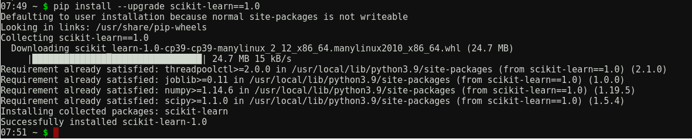
    
The upgraded packages roughly takes some 110+ MB
    
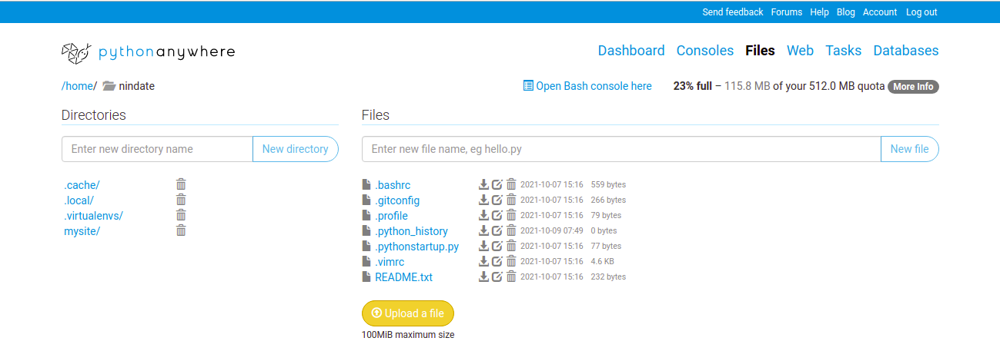
    

#### 3. Create/Deploy your Web App
 
**a.** Now you can create your Webapp (The free account allows deploying a single webapp). Click on **Web**, then click **+ Add a new web app**

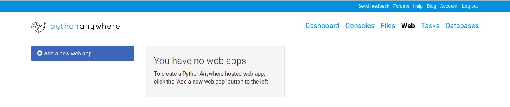
    

    
**b.** Select **Flask**
    
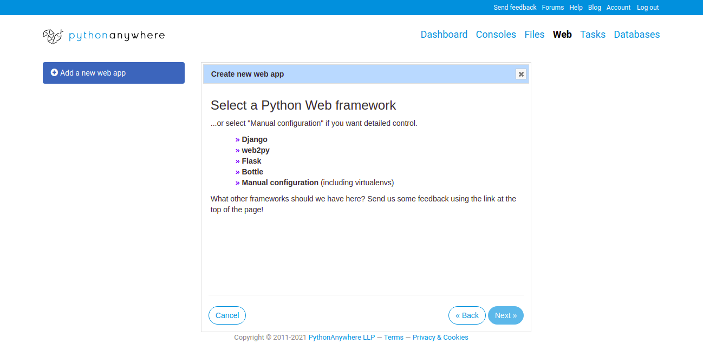
    
**c.** Then, select **Python 3.8**
    
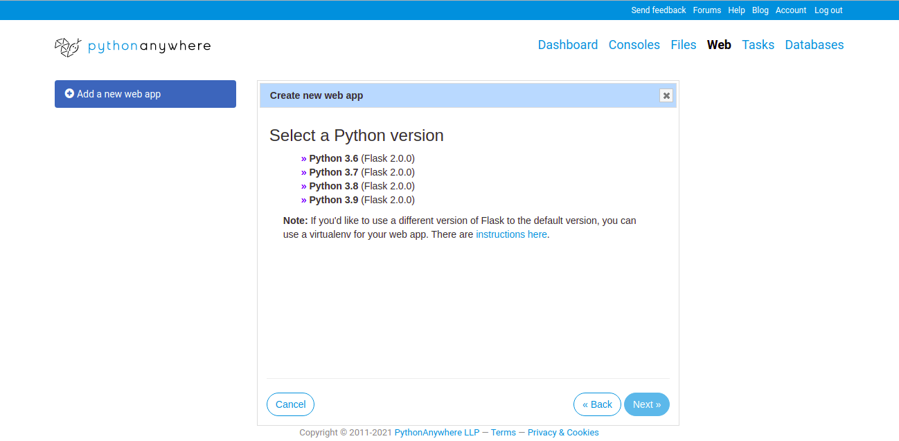
    
**d.** You can now accept the default path and filename for the python code for flask app (I chose default), or you can provide details as per your preference.
    
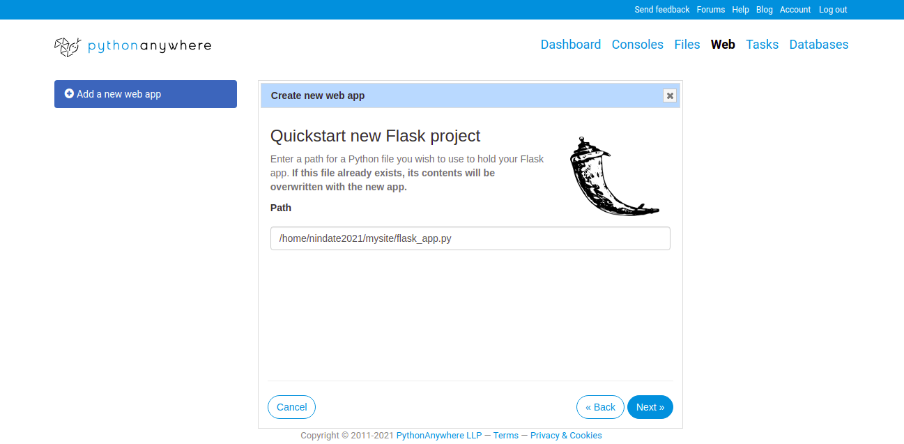
    
**e.** Your web app is now deployed and active (with a default code). For the free account, to keep your web app active, you need to click the **Run until 3 months from today** atleast once before the 3 months expire.
   
Make a note of the URL for your web app (this is typically https://yourid.pythonanywhere.com)
    
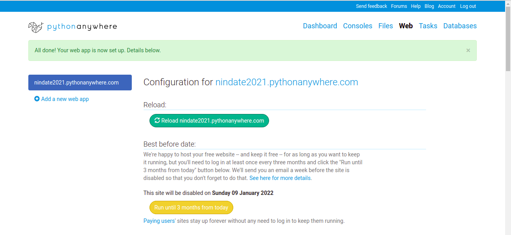
    
**f.** Test the sample web app (with the default code). Open a tab in your browser and paste your web app URL
   

   
To view/edit the default code, go to Files and navigate to the appropriate file in the path (if you chose the default then it is mysite/flask_app.py)
   
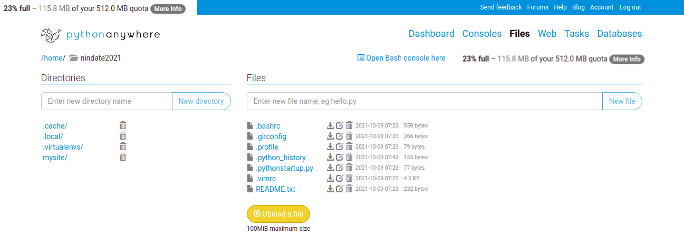
   
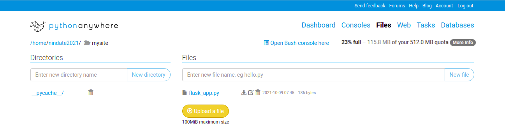
   
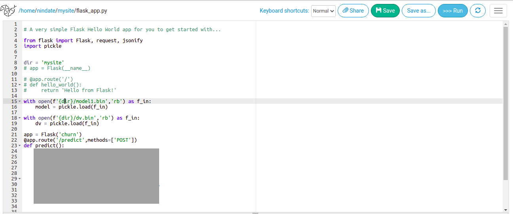
   
**g.** Now edit the default code and update it with appropriate code for your task, click on **Save**.
 

 
**h.** Click  to reload the web app from the code you updated and saved.

#### 4. Upload ML model files (if/as applicable)

**a.** Upload any ML model files (e.g. the dv.bin for the DictVectorizer and model2.bin for the LogisticRegression trained model - as per homework for ML Zoomcamp course Week#5)

Click on **Files**, go to the path where the python code for ther web has been deployed (in this example - mysite), click **Upload a file** and upload your model file(s) as applicable.

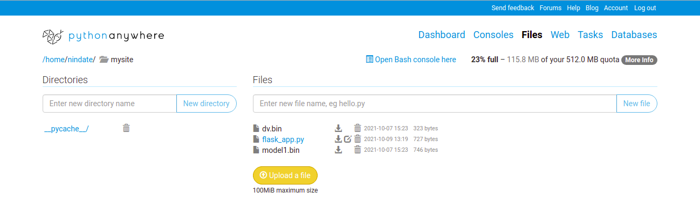

#### 5. Test your Web App
 
You can now test whether your Web App is running successfully (now being hosted on PythonAnywhere). From your local machine (or from anywhere, where you have python installed, requests package installed and having internet access) execute the code to test your Web App.
 
Below is sample test scenario for the homework of Week5 of ML Zoomcamp course.
 
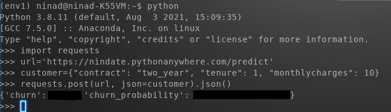

